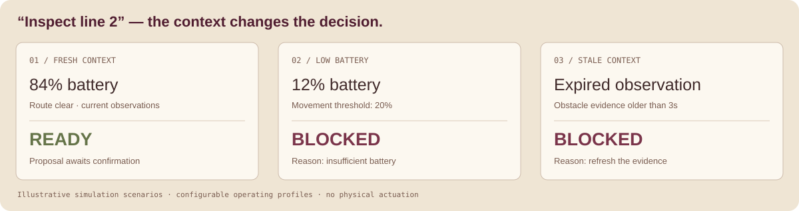
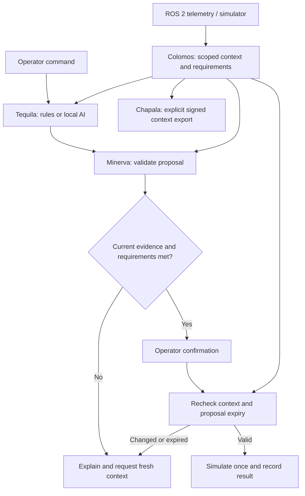

# ROSA · by CDT


**Robotics Operational Systems and Agave**

**Context that connects robots, operators and AI.** ROSA is an open, MIT-licensed layer for robot context, command interpretation and inspectable decisions. It builds on established robotics interfaces and grows through continuous experimentation against the requirements of advanced industrial robotic systems.

**Minerva · v0.4.0** · [Español](docs/README.es.md) · [API](docs/API.md) · [Integration](docs/INTEGRACIONES.md) · [Quality](QUALITY_DECLARATION.md) · [Migration](docs/MIGRATION.md)

[](https://github.com/IgDiaz/ROSA/actions/workflows/tests.yml)

[Interactive lab](https://rosa.cdtglobal.org/) · [Run the simulator](https://rosa.cdtglobal.org/demo) · [Development roadmap](docs/ROADMAP.md)

## Built to evolve with your system

A request such as **inspect line 2** gains meaning when the application knows the robot's capabilities, battery, route and current observations. ROSA turns that evidence into an explained proposal, checks it again at confirmation and keeps a trace of the outcome.

ROS 2 supplies its drivers, communication and application ecosystem. ROSA contributes context and command orchestration alongside it. The current release supports local simulation and ROS 2 observation; physical execution belongs to a separately validated, robot-specific integration.

## Quick Start

### Requirements

- **Python 3.11+** and Git, on Windows, macOS or Linux.
- The offline simulator uses the Python standard library; ROS 2, a GPU and an AI model are optional integrations.
- This guide installs **ROSA by CDT** (`rosa-robotics-kit`) from **IgDiaz/ROSA**. Use the dedicated environment below to keep its `rosa` import separate from other projects with the same name.

### Installation

Download the repository and create an isolated environment. Use `python3` if your system requires it:

```bash
git clone https://github.com/IgDiaz/ROSA.git
cd ROSA
python -m venv .venv
```

**Windows — PowerShell or Command Prompt**

```powershell
.venv\Scripts\python.exe -m pip install .
.venv\Scripts\python.exe -m rosa
```

**macOS / Linux**

```bash
.venv/bin/python -m pip install .
.venv/bin/python -m rosa
```

### Your first experiment

Open **http://127.0.0.1:8765** in your browser. Keep the terminal running; `Ctrl+C` stops the local server. Add `--port 8770` if the default port is occupied.

1. Propose **Inspect line 2**, review the reason, then confirm the simulation.
2. Select **Low battery** and submit the same request: the operating requirements change the decision.
3. Try **Blocked route** or **No telemetry**. Observe how the explanation changes when evidence is obstructed or expires.

The console animates simulated state transitions and generates labelled example findings. The illustration below summarizes the default scenarios; it is not a live telemetry feed.



### How the layers work together



ROS 2 provides the communication and robotics interfaces. ROSA adds scoped context, interpretation and reviewable command decisions. The diagram's execution path is the included simulator; the ROS 2 adapter observes and publishes context. [Architecture and integration boundaries](docs/ARCHITECTURE.md).

## Libraries and codenames

| Name | Module | Responsibility |
|---|---|---|
| **Colomos** | `rosa.context`, `rosa.profile` | Scoped SQLite memory, persisted operating requirements, acquisition and reception timestamps, source allowlists and replay checks |
| **Minerva** | `rosa.policy`, `rosa.runtime` | Deterministic checks, context revisions, expiring proposals and idempotent simulation |
| **Tequila** | `rosa.planner` | Offline command grammar and optional local Ollama interpretation |
| **Tonalá** | `rosa.ros2`, `rosa.telemetry` | ROS 2 observation and a versioned acquisition-time telemetry contract |
| **Chapala** | `rosa.gateway` | Explicit signed HTTPS context export and advisory recording |

These modules ship together as the `rosa-robotics-kit` Python distribution, imported as `rosa`.

## Use operating requirements

```python
from rosa import ContextStore, OperationalProfile, Runtime, Scope

store = ContextStore(":memory:")
robot = Scope("factory", "amr_01")
profile = OperationalProfile(minimum_battery=30, obstacle_ttl_s=2,
                             proposal_ttl_s=15, allowed_sources=("simulator",))
store.register(robot, profile=profile)
store.observe(robot, {"battery": 82, "obstacle": False,
                      "estop": False, "position": "base"}, source="simulator")
plan = Runtime(store).propose(robot, "Inspect line 2")
print(plan["status"], plan["reason"])
# Obtain operator confirmation in your application before this call.
if plan["status"] == "ready":
    Runtime(store).execute_simulation(robot, plan["id"])
store.close()
```

Requirements are stored per robot. `configure()` explicitly updates them and invalidates outstanding proposals. Strict observation profiles require acquisition timestamps; sequence checks prevent a replay from making old evidence look current. Source names must be bound to authenticated adapters by the integration. Confidence is adapter-supplied metadata, not a calibrated safety probability.

## Integration and experimentation

- **ROS 2:** the observer uses upstream `rclpy`, `sensor_msgs` and `std_msgs`. CI includes a real Jazzy graph with synthetic timestamped telemetry and replay rejection. [Run that experiment](docs/INTEGRACIONES.md).
- **Local AI:** start with `python -m rosa --ollama-model YOUR_INSTALLED_MODEL`. Structured outputs pass the same deterministic rules. Model-specific accuracy, latency and hardware requirements are measured in the next experiment stage.
- **Agents:** `AgentGateway.publish()` sends an allowlisted context envelope over signed HTTPS to your configured receiver. [Authentication and receiver responsibilities](docs/INTEGRACIONES.md).

The included execution API applies simulated effects. Hardware actuation, model-specific validation and external-platform delivery each have their own acceptance criteria in the [roadmap](docs/ROADMAP.md). Functional safety and the physical stop remain the robot system's responsibility.

## Quality you can inspect

- **43 regression tests** covering context age, requirements, source restrictions, replay, migration, concurrent confirmation, adapter contracts and the local console.
- Linux, Windows and macOS test matrix with Python 3.11/3.12.
- Branch-aware coverage with an enforced **80% minimum** for the measured SDK/console scope; ROS bridge and CLI are tracked separately.
- Static error checks, JSON contract validation, installed-wheel checks and a real ROS 2 Jazzy integration job.
- A repeatable timing experiment publishes CI evidence for this implementation; it makes no comparative claim against ROS 2.

See the [quality declaration](QUALITY_DECLARATION.md), [validation scope](docs/VALIDACION.md) and [contribution guide](CONTRIBUTING.md). These practices take REP-2004 as a reference; maturity is demonstrated per capability and deployment environment.

## Repository scope

`rosa/` contains the SDK and its local console; `schemas/` the integration contracts; `examples/` runnable starting points; `tests/` regression and ROS integration checks; `scripts/` quality experiments; `docs/` integration and API guidance. The website is maintained separately and imports a pinned SDK version.

The Python distribution is `rosa-robotics-kit`, maintained by CDT at `IgDiaz/ROSA`. Use a dedicated virtual environment: NASA/JPL maintains a different package, `jpl-rosa`, which also uses the `rosa` import name. Install this project from the repository above and consult the [0.4 upgrade guide](docs/MIGRATION.md).

## License and provenance

Copyright © 2026 CDT. Original code remains under the [MIT License](LICENSE). [LICENSE-CDT](LICENSE-CDT) records CDT's grant under the same MIT terms without added restrictions. Third-party code and model weights retain their own licenses; see [third-party notices](THIRD_PARTY_NOTICES.md), [privacy](PRIVACY.md) and [security](SECURITY.md).

ROSA is independently maintained by CDT and is not affiliated with ROS, Open Robotics, Ollama or NASA/JPL's ROSA project. Development uses AI assistance with explicit tests and maintainer review. ROS 2 libraries are consumed through their public interfaces; they are not copied or relicensed as ROSA code.
