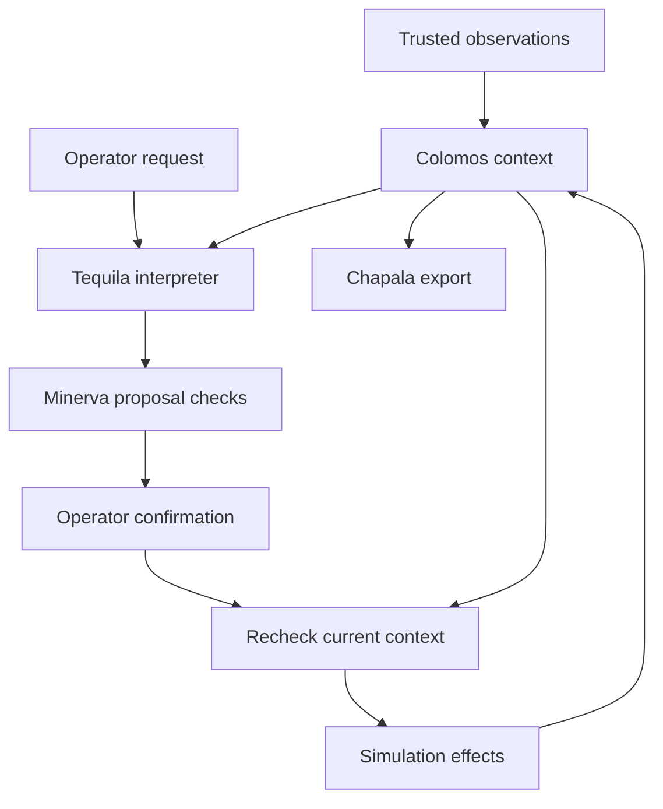

# Architecture

The core is independent of ROS, web frameworks and language models. Optional adapters translate external inputs into documented contracts.

## Trust boundaries

Sensor observations are authoritative only after the integrator authenticates the source. The SDK checks types, bounds and timestamps, but does not authenticate arbitrary Python callers or ROS publishers. Model output is an untrusted intent; only registered action/destination pairs survive validation. Agent recommendations are text, not sensor facts or execution authority. Execution here means simulated effects; physical control needs another adapter and a robot-specific safety design.

## Data model

The compound key `(user_id, robot_id)` scopes profiles, facts, proposals and events. Facts carry source, confidence and local time. Revision changes when value, source or confidence changes; timestamp-only heartbeats refresh evidence without changing revision.

An execution transaction loads a proposal, checks revision/expiration, re-evaluates policy, applies simulated effects, records completion and writes an event. An already completed proposal returns its saved result. Snapshot revision and facts are read in one SQL statement. The store retains latest facts and event/proposal evidence, not a continuous sensor time series.

## Local console and consuming applications

The bundled local console serves one operator on loopback, with SQLite history,
an optional local Ollama model and a virtual-sensor heartbeat thread. Its UI is
packaged with the SDK so a clean install works without the public website.

Other applications import the same runtime and policy rather than copying them.
The separately maintained website is one consumer. Its web framework, sessions
and deployment configuration are outside this package. JavaScript in the local
console displays SDK outcomes; it does not reimplement eligibility rules.

## Constraints

ROS stamped telemetry preserves acquisition time and sequence; legacy Bool/String inputs use reception time. Namespaces do not authenticate publishers. Destinations are fixed labels, not geometric maps. Operating thresholds and freshness windows are configurable per robot; default values and simulated battery costs are illustrative. The gateway has no durable queue or inbound HTTP service. There is no real-time scheduler, navigation stack, secure boot or certified safety behavior.
