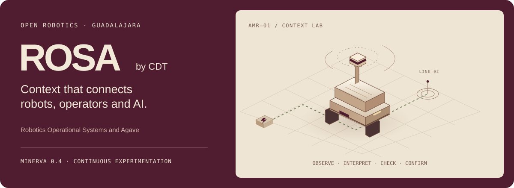

# ROSA · por CDT

**Robotics Operational Systems and Agave**

Una capa abierta que conecta contexto operativo, comandos, agentes e IA local. ROSA se fortalece mediante experimentación continua y validaciones reproducibles, siguiendo los requisitos de sistemas robóticos industriales cada vez más avanzados.

La versión **Minerva 0.4.0** incorpora perfiles operativos por robot, memoria SQLite, fechas de adquisición y recepción, rechazo de repeticiones, reglas independientes del modelo y propuestas con evidencia verificable. Trabaja junto a las bibliotecas y herramientas de ROS 2.

## Inicio rápido

Requisitos: **Python 3.11+ y Git**. La simulación por reglas funciona sin ROS 2, GPU ni modelos externos. Instala **ROSA por CDT** (`rosa-robotics-kit`) en su propio entorno para evitar colisiones del nombre `rosa`.

```bash
git clone https://github.com/IgDiaz/ROSA.git
cd ROSA
python -m venv .venv
```

En **Windows**:

```powershell
.venv\Scripts\python.exe -m pip install .
.venv\Scripts\python.exe -m rosa
```

En **macOS/Linux** (usa `python3` para crear el entorno si tu sistema lo requiere):

```bash
.venv/bin/python -m pip install .
.venv/bin/python -m rosa
```

Abre **http://127.0.0.1:8765**. Propón «Inspecciona línea 2», revisa la explicación y confirma la simulación. Cambia la batería o bloquea la ruta y compara el resultado. `Ctrl+C` detiene el servidor.



Consulta el [diagrama de arquitectura y los escenarios](../README.md#how-the-layers-work-together). Colomos conserva el contexto por robot; Tequila interpreta; Minerva valida y comprueba nuevamente al confirmar. Tonalá conecta observaciones ROS 2 y Chapala permite exportaciones explícitas hacia agentes.

## Recursos

- [API pública](API.md): requisitos, memoria, propuestas y contratos.
- [Integración ROS 2 y agentes](INTEGRACIONES.md): adquisición, identidad y experimentos reproducibles.
- [Calidad](../QUALITY_DECLARATION.md): prácticas actuales y siguientes criterios de aceptación.
- [Evidencia](VALIDACION.md): pruebas, cobertura e integración automatizada.
- [Actualización a 0.4](MIGRATION.md): imports, nombres y bases de datos.
- [Hoja de ruta](ROADMAP.md): evolución guiada por aplicaciones industriales.

El alcance operativo de esta versión es simulación y observación ROS 2. Cada integración física o modelo local se valida en su entorno antes de ampliar capacidades. Las licencias MIT, el aviso de aportaciones CDT y las licencias originales de terceros se conservan.
